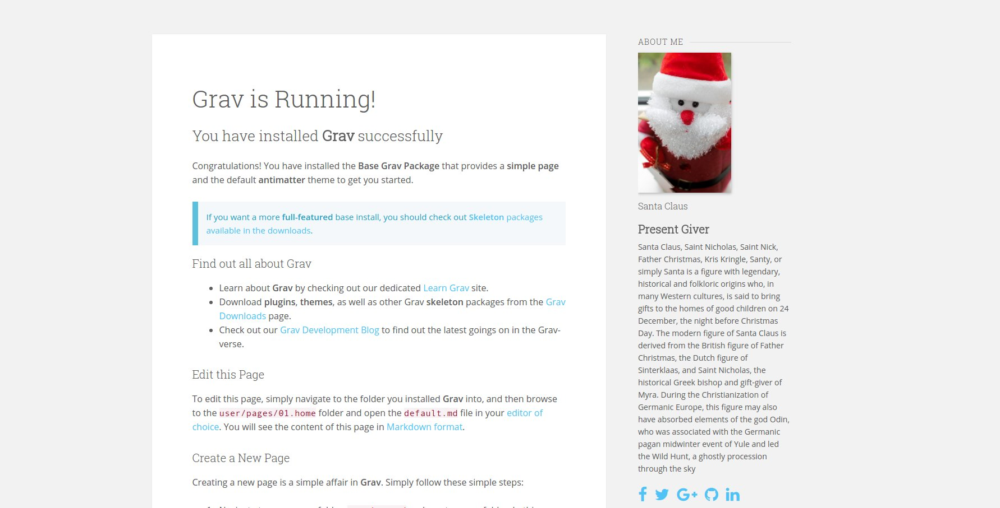
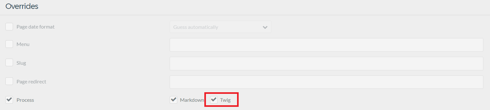

# Grav AboutMe Plugin



AboutMe is a simple plugin to show some information about yourself, with a nice picture, your name, your title/job and a description.
You can also add links to your social network pages (Twitter, Facebook, GitHub, LinkedIn, Instagram).

## Features

- Pick an avatar, either from your computer or from gravatar
- Let your visitors know a bit more about yourself, give your name, title/job and a nice description
- Add links to your social network pages (Including: Twitter, Facebook, GitHub, LinkedIn, Instagram). It uses FontAwesome icons, if your theme already loads it, you don't need to enable the option in the plugin configuration
- Add other social network pages
- Add [h-card](http://microformats.org/wiki/h-card) microformats to your homepage to help re-decentralize the Web with the [Indieweb](https://indieweb.org) principles.

## Installation

Installing the AboutMe plugin can be done in one of two ways. GPM (Grav Package Manager) installation method enables you to quickly and easily install the plugin with a simple terminal command, while the manual method enables you to do so via a zip file.

### GPM Installation (Preferred)

The simplest way to install this plugin is via the [Grav Package Manager (GPM)](http://learn.getgrav.org/advanced/grav-gpm) through your system's Terminal (also called the command line). From the root of your Grav install type:

    bin/gpm install aboutme

This will install the AboutMe plugin into your `/user/plugins` directory within Grav. Its files can be found under `/your/site/grav/user/plugins/aboutme`.

### Manual Installation

To install this plugin, just download the zip version of this repository and unzip it under `/your/site/grav/user/plugins`. Then, rename the folder to `aboutme`. You can find these files either on [GitHub](https://github.com/getgrav/grav-plugin-aboutme) or via [GetGrav.org](http://getgrav.org/downloads/plugins#extras).

You should now have all the plugin files under

    /your/site/grav/user/plugins/aboutme

> NOTE: This plugin is a modular component for Grav which requires [Grav](http://github.com/getgrav/grav), the [Error](https://github.com/getgrav/grav-plugin-error) and [Problems](https://github.com/getgrav/grav-plugin-problems) plugins, and a theme to be installed in order to operate.

## Config Options

To effectively use the plugin, you first need to create an override config. To do so, create the folder `user/config/plugins` (if it doesn't exist already) and copy the [aboutme.yaml][aboutme] config file in there.

```yaml
enabled: true # Activate the plugin
built_in_css: true # Use the default CSS

name: "Santa Claus" # Your full name
title: "Present Giver" # Your title/job
show_title: true # Show your title/job
description: "Santa Claus, Saint Nicholas, Saint Nick, Father Christmas, Kris Kringle, Santy, or simply Santa is a figure with legendary, historical and folkloric origins who, in many Western cultures, is said to bring gifts to the homes of good children on 24 December, the night before Christmas Day. The modern figure of Santa Claus is derived from the British figure of Father Christmas, the Dutch figure of Sinterklaas, and Saint Nicholas, the historical Greek bishop and gift-giver of Myra. During the Christianization of Germanic Europe, this figure may also have absorbed elements of the god Odin, who was associated with the Germanic pagan midwinter event of Yule and led the Wild Hunt, a ghostly procession through the sky" # Tell us a bit about yourself

picture_src: # The path of your avatar, I recommand to use the admin plugin and go to the plugin configuration so you can upload your avatar there, the path will be filled for you.
  user/plugins/aboutme/assets/avatars/santa.jpg:
    name: santa.jpg
    type: image/jpeg
    size: 43391
    path: user/plugins/aboutme/assets/avatars/santa.jpg

gravatar:
  enabled: false # Enables gravatar, it will override picture_src option
  email: "example@test.com" # The email address your gravatar is attached to
  size: 100 # The size of your gravatar

social_pages:
  enabled: true # Enables social network pages
  use_font_awesome: false # Use FontAwesome, enable this option only if FontAwesome is not loaded by your theme or another plugin
  pages: # Your social network pages here ! Change the order at will by changing the default position value. You can also change the font icon and the title
    facebook:
      icon_type: b
      icon: facebook
      title: Facebook
      position: 1
    twitter:
      icon_type: b
      icon: twitter
      title: Twitter
      position: 2
    github:
      icon_type: b
      icon: github
      title: GitHub
      position: 3
    linkedin:
      icon_type: b
      icon: linkedin
      title: LinkedIn
      position: 4
    instagram:
      icon_type: b
      icon: instagram
      title: Instagram
      position: 5
```

By creating the configuration file: `user/config/plugins/aboutme.yaml` you have effectively created a site-wide configuration for AboutMe.
If you use the [Admin Plugin](https://github.com/getgrav/grav-plugin-admin) you can directly change the configuration for this plugin in the admin control panel.

### Add other social network pages

In order to do that, you have to be sure the social network you want to add has an icon available in FontAwesome. You can check [here](http://fortawesome.github.io/Font-Awesome/icons/)
For exemple you have a Pinterest account, FontAwesome offers you 3 icons, `pinterest`, `pinterest-p` and `pinterest-square`. Choose one that suits you and add it to your `user/config/plugins/aboutme.yaml` in the `pages` section like this:

```yaml
social_pages:
  enabled: true
  use_font_awesome: false
  pages:
    twitter:
      icon_type: b
      icon: twitter
      title: Twitter
      position: 1
      url: https://twitter.com/myaccount
    pinterest:
      icon_type: b # 'b' is for brand, 's' for solid and 'r' for regular. Official social icons are always brand icons.
      icon: pinterest # You can replace pinterest by pinterest-square or pinterest-p depending on which icon you want
      title: Pinterest # Change the title if you don't like this one
      position: 2 # Position the link will appear at
      url: https://www.pinterest.com/mylogin/ # Your Pinterest account link
```

## Usage

It's pretty straight forward actually, just include the partial template from the plugin wherever you want it to show in your page.

```

```

Don't forget to activate Twig processing in advanced options so the code above is processed.


## Updating

As development for AboutMe continues, new versions may become available that add additional features and functionality, improve compatibility with newer Grav releases, and generally provide a better user experience. Updating AboutMe is easy, and can be done through Grav's GPM system, as well as manually.

### GPM Update (Preferred)

The simplest way to update this plugin is via the [Grav Package Manager (GPM)](http://learn.getgrav.org/advanced/grav-gpm). You can do this with this by navigating to the root directory of your Grav install using your system's Terminal (also called command line) and typing the following:

    bin/gpm update aboutme

This command will check your Grav install to see if your AboutMe plugin is due for an update. If a newer release is found, you will be asked whether or not you wish to update. To continue, type `y` and hit enter. The plugin will automatically update and clear Grav's cache.

> Note: Any changes you have made to any of the files listed under this directory will also be removed and replaced by the new set. Any files located elsewhere (for example a YAML settings file placed in `user/config/plugins`) will remain intact.
